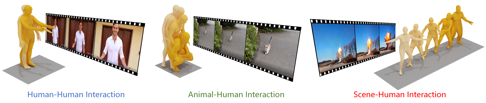

# HERO: Human Reaction Generation from Video (ICCV 2025)
### [[ArXiv]](https://arxiv.org/abs/2503.08270) 


## :round_pushpin: Get You Ready

<details>
  
### 1. Environment and Dependencies
```
cd HERO_release
conda create -n HERO python=3.10
conda activate HERO
pip install -r requirements.txt
pip install mmcv-full==1.7.0 -f https://download.openmmlab.com/mmcv/dist/cu113/torch1.12/index.html
```

### 2. Models
Visit [[Google Drive]](https://drive.google.com/file/d/1KEi6r7vIFnkoLLrZaN2ZKUzQFxxXIi75/view?usp=sharing) to download the models mannually, then unzip and place the result in `./checkpoints`.

### 3. Dataset

Download [ViMo](https://drive.google.com/file/d/182yLuEVtESIrVXshrJeNS8dbx6sxGB13/view?usp=sharing) dataset, then unzip and place the result in `/root/autodl-tmp/Data/VIMO`.

#### 

</details>

## :space_invader: Train the Models
<details>


**Note**: You have to train RVQ **BEFORE** training masked/residual transformers. The latter two can be trained simultaneously.

### Train RVQ
```
python train_vq_vimo.py --name rvq_bs256_finetune_ep10 --gpu_id 0 --window_size 20 \
    --dataset_name vimo --batch_size 256 --num_quantizers 6 --max_epoch 10 \
    --warm_up_iter 20 --milestones 1600 3200 --finetune
```

### Train Masked Transformer
```
python train_mask_transformer_memo_cross_vimo.py --name mtrans_memo_cross_l6_bs64_ep200 --gpu_id 0 \
    --dataset_name vimo --batch_size 64 --max_epoch 200 --vq_name rvq_bs256_finetune_ep10 \
    --milestones 6000 --warm_up_iter 250 --n_layers 6
```

### Train Residual Transformer
```
python train_res_transformer_memo_cross_vimo.py --name rtrans_memo_cross_l6_bs64_ep200 --gpu_id 1 \
    --dataset_name vimo --batch_size 64 --max_epoch 200 --vq_name rvq_bs256_finetune_ep10 \
    --milestones 6000 --warm_up_iter 250 --n_layers 6
```
  
* `--name`: name your model. This will create to model space as `./checkpoints/<dataset_name>/<name>`
* `--batch_size`: we use `256` for rvq training. For masked/residual transformer, we use `64`.
* `--num_quantizers`: number of quantization layers, `6` is used in our case.
* `--quantize_drop_prob`: quantization dropout ratio, `0.2` is used.
* `--vq_name`: when training masked/residual transformer, you need to specify the name of rvq model for tokenization.
* `--cond_drop_prob`: condition drop ratio, for classifier-free guidance. `0.2` is used.
* `--share_weight`: whether to share the projection/embedding weights in residual transformer.

All the trained models and intermediate results will be saved in space `./checkpoints/<dataset_name>/<name>`.
</details>

## :book: Evaluation
<details>

### Evaluate RVQ Reconstruction:
```
python eval_vq_vimo.py --gpu_id 0 --name rvq_bs256_finetune_ep10 --dataset_name vimo --ext rvq_nq6
```

### Evaluate Video-to-reaction Generation:
```
python eval_trans_res_memo_cross_vimo.py --dataset_name vimo --vq_name rvq_bs256_finetune_ep10 \
    --name mtrans_memo_cross_l6_bs64_ep200 --res_name rtrans_memo_cross_l6_bs64_ep200 \
    --gpu_id 1 --cond_scale 4 --time_steps 10 --ext rvq1_rtrans1_bs64_cs4_ts10-newData \
    --which_epoch all --test_txt test.txt
```

* `--name`: model name of `masked transformer`. 
* `--res_name`: model name of `residual transformer`.  
* `--cond_scale`: scale of classifer-free guidance.
* `--time_steps`: number of iterations for inference.
* `--ext`: filename for saving evaluation results.
* `--which_epoch`: checkpoint name of `masked transformer`.

The final evaluation results will be saved in `./checkpoints/<dataset_name>/<name>/eval/<ext>.log`

</details>

## Acknowlegements

We sincerely thank the open-sourcing of these works where our code is based on: 

[MoMask](https://github.com/EricGuo5513/momask-codes/tree/main), [TC-CLIP](https://github.com/naver-ai/tc-clip), [T2M-GPT](https://github.com/Mael-zys/T2M-GPT) and [MLD](https://github.com/ChenFengYe/motion-latent-diffusion/tree/main).

## Citation

If you find our code or paper helpful, please consider starring our repository and citing:
```
@article{yu2025hero,
  title={HERO: Human Reaction Generation from Videos},
  author={Yu, Chengjun and Zhai, Wei and Yang, Yuhang and Cao, Yang and Zha, Zheng-Jun},
  journal={arXiv preprint arXiv:2503.08270},
  year={2025}
}
```
